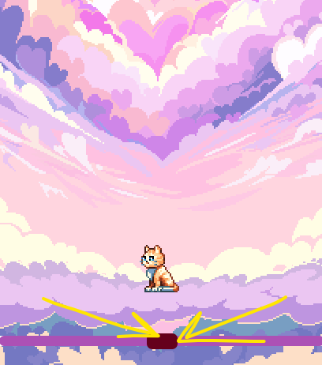
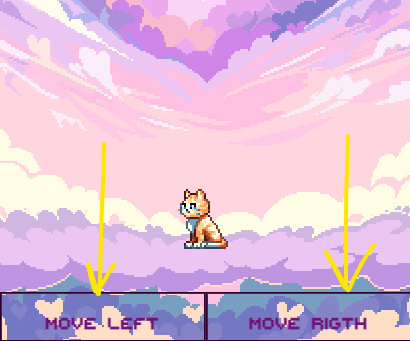
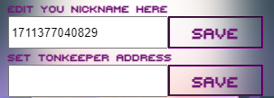
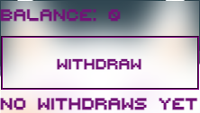
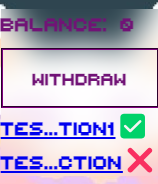

## Как играть | Kitten heart FAQ

---

#### Содержание:
  
 - [Управление](#moves)
 - [Настройки](#setting)
 - [Вывод токенов](#withdraw)

---
### Управление

---
На стартовой странице доступно 2 уровня сложности.
Простой и сложный.

При выборе <b>легкой сложности</b>, управление осуществляется с помощью
ползунка.

Напрвление персонажа будет меняться в зависимости от положения ползунка относительно середины.
Середина это 0. Если двинуть ползунок влево, персонаж побежит влево.
Если вправо, то в право.
Чем дальше от середины находится ползунок, тем быстрее в определенную сторону бежит персонаж.

При выборе <b>сложного</b> режима.
Управление осуществляется по нажатию на кнопки. 

Однократное нажатие на кнопку увеличивает скорость движения на фиксированное значение.
Это значит, что для того что бы бежать, например влево, быстрее, надо много раз нажимать кнопку движения влево.
Чем чаще жмешь, тем быстрее бежишь.
Если вы до этого двигались влево и хотите начать движение вправо, то нажатие кнопки вправо не заставит персонаж мнгновенно развенуться.
Нажатие на кнопку противоположного движения лишь сократит скорость на фиксированное значение.
Это значит, что бы сменить направление, при условии, что вы уже бежите влево, нужно нажимать кнопку движения вправо много раз, до тех пор пока скорость движения влевро не снизится до нуля, только после этого начнется движение вправо.

---
### Настройки 

---

Нажав на стартовой странице  вы попадете на страницу настроек. 
На данны момент в настройках доступно 2 параметра

Первй параметр - ваш никнейм. Вы можете редактировать его сколько угодно раз.
Выбранный ник будет доступн на станице с таблицей лидеров.

Второй параметр - адресс вашего кошелька в сети ton. Я рекомендую использовать tonkeeper.
Данный параметр нужен для того что бы выводить токены [KITTY](https://tonviewer.com/EQA4hHhqVgyGx9zoFwhlhLJcZDCC0uzZgR8m9QYPBxuiiSCa)

<b>УБЕДИТЕСЬ</b>, что указали корректный адресс вашего кошелька, вернуть токены выведенные на ошибочный адресс будет невозможно.

---
###  Вывод токенов

---

При нажатии на кнопку  на стартовой странице, вы попадёте на страницу вывода.
Страница вывода содержит информацию о текущем балансе. Кнопку вывода и список ранее совершенных транзакций

Баланс - это сумма ваших очков по итогам каждой сыгранной игры.
Этот баланс будет доступен для вывода в ближайшее время. На текущий момент, функциональность вывода заблокирована.

Под кнопкой вывода содержится информация о совершенных транзакциях вывода. На приведенном выше примере транзакции отсутсвуют

Так выглядит список совершенных транзакций :

Зеленый чекбокс означает, что транзакция подтверждена и токены должны поступить вам.
Красный крестик - транзакция еще не подтверждена.

---

## Спасибо за то, что играете!